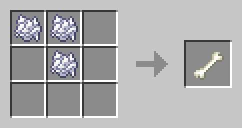

# Уникальные крафты


Ряд пользователей столкнулись с некорректным отображением рецептов крафта в игровом интерфейсе (включая верстак, камнерез и прочие инструменты). Проблема вызвана **несовместимостью версий** — серверное ядро 1.21.3 конфликтует с клиентскими сборками игры, **более старыми, чем 1.21.3**. На самой версии 1.21.3, а также на более новых (если таковые существуют) рецепты отображаются и функционируют корректно.


### Верстак

<figure><figcaption>
<strong>› Невидимый свет</strong>
</figcaption></figure>

<figure><figcaption>
<strong>› Кость</strong> 
</figcaption></figure>

<figure><figcaption>
<strong>› Паутина</strong>
</figcaption></figure>

<figure><figcaption>
<strong>› Огненный стержень</strong>
</figcaption></figure>

<figure><figcaption>
<strong>› Нитки</strong>
</figcaption></figure>

<figure><figcaption>
<strong>› Осколки аметиста</strong>
</figcaption></figure>

### Камнерез

<figure><figcaption>
<strong>›</strong> Светокамень
</figcaption></figure> <figure><figcaption>
› Смоляной кирпич
</figcaption></figure> <figure><figcaption>
› Кирпич
</figcaption></figure>

